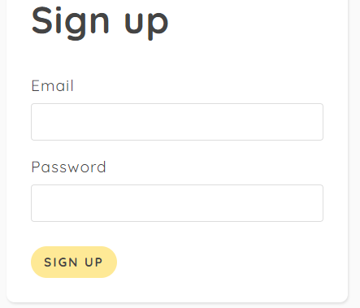
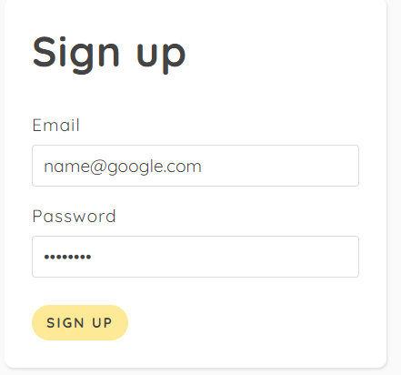
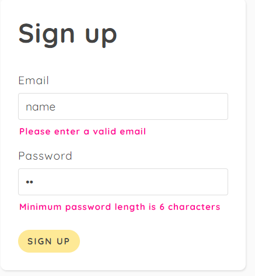

## first we empty our email and password text bar every time we submit

```js
e.preventDefault();
       emailError.textContent = '';
       passwordError.textContent = '';
```


## Second we get our value from the input
```js
const email = form.email.value;
 const password = form.password.value;
      
```

## 3rd i will grap email and password from the input
```js
const res = await fetch('/signup',{
            method: 'POST',
            body: JSON.stringify({email, password}),
             headers: {'Content-Type': 'application/json'}
            }) 
```


## now we get response and we pass that to javascript object (data)
## if we have error we will get message from email error
```js
onst data = await res.json();
            console.log(data);  
            if (data.errors){
              emailError.textContent = data.errors.email;
              passwordError.textContent = data.errors.password;
            }    
```


```js
form.addEventListener('submit', async (e) => {
    e.preventDefault();
       emailError.textContent = '';
       passwordError.textContent = '';
    // get values
    const email = form.email.value;
    const password = form.password.value;
      
      try{
           const res = await fetch('/signup',{
            method: 'POST',
            body: JSON.stringify({email, password}),
             headers: {'Content-Type': 'application/json'}
            }) 
            const data = await res.json();
            console.log(data);  
            if (data.errors){
              emailError.textContent = data.errors.email;
              passwordError.textContent = data.errors.password;
            }    
             if (data.user){
              location.assign('/');
             }


      }catch(err){
           console.log(err);
}})


```